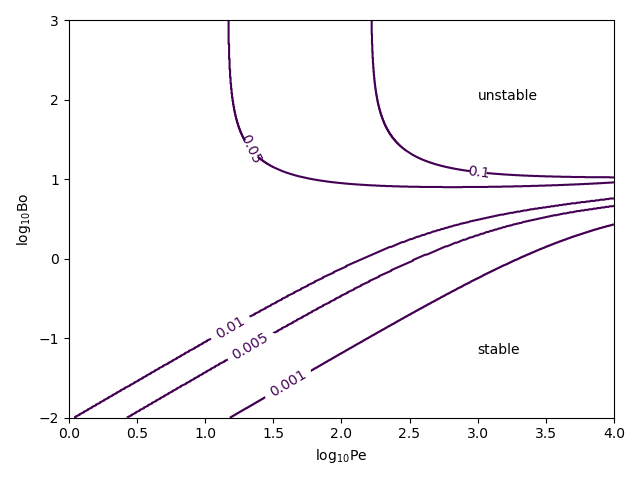

# stability_rt

This code is designed to compute stability maps of a two-phase fluid in a Darcy porous medium with the Cahn-Hilliard model for phase description.

A stability map shows whether an initial configuration is stable under small perturbations for a given value of the parameters.
As the parameters are changed, the configuration could transition from stable to unstable, or vice versa.
The parameters considered in this software are:

- Biot number (Bo)
- Cahn number (Ch)
- Peclet number (Pe)
- sign of the phase field: +1 if the light fluid is on top of the heavy fluid, -1 if the light fluid is at the bottom of the heavy fluid.
- components of the perturbation's wave vector (k, l) in the direction orthogonal to gravity. Set l=0 for a two-dimensional perturbation.

# Usage

After cloning the repository, make sure to set the environment variables specifying the locations of boost and Eigen libraries if required.
For example,
```
export BOOST_INCLUDE_DIR=/usr/include/boost
export EIGEN3_INCLUDE_DIR=/usr/include/eigen3
```
You can also set the include directories directly in the Makefile.


Then, you can build the executables as follows:
```
cd stability_ry
make
```

# Example
Stability map built with `two_parameters.cc`.
The contours lines are iso-Cahn number curves.




# References

For a description of the model, see:

- M. De Paoli: *Convection in porous media*, PhD Thesis, Università di Udine, 2017

